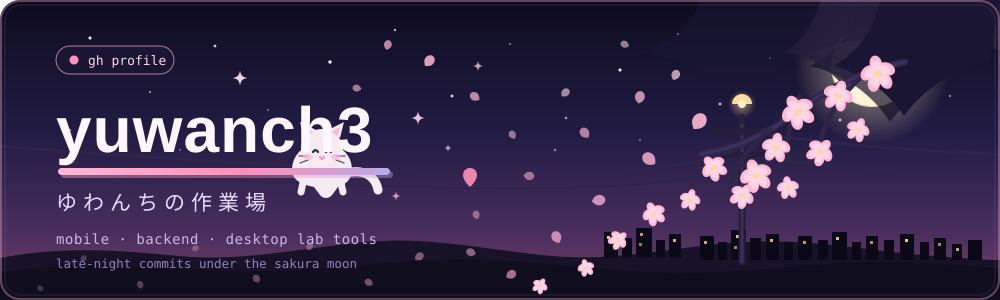

  

  

─── ⸜(｡˃ ᵕ ˂ )⸝ ───

### 🌸 ようこそ · Welcome

**Yuwanch3** here — I build things I actually want to use.

Mostly **React Native + TypeScript** during the day (my learning app [**Ambativasi**](https://github.com/yuwanch3/Ambativasi-apps) grows every week), and **Python** at night wiring desktop tools to real lab hardware in [**PyLabView Studio**](https://github.com/yuwanch3/py-labView).

> **now →** polishing Ambativasi · adding adapters to PyLabView · shipping small, learning always

**outside the editor →** anime nights, gacha regrets, and one more cup of coffee ฅ^•ﻌ•^ฅ

─── ˚ ⋆ ｡ ✦ ˚ ⋆ ───

### ⚔️ つかうもの · Toolbox

<table>
<tr>
<td align="center"><b>📱 Mobile</b></td>
<td><code>react</code> <code>typescript</code> <code>expo</code></td>
</tr>
<tr>
<td align="center"><b>🌐 Web &amp; API</b></td>
<td><code>javascript</code> <code>html</code> <code>css</code> <code>php</code></td>
</tr>
<tr>
<td align="center"><b>🐍 Lab &amp; Data</b></td>
<td><code>python</code> <code>tkinter</code> <code>opencv</code></td>
</tr>
<tr>
<td align="center"><b>🗄 Store &amp; Ship</b></td>
<td><code>mysql</code> <code>git</code> <code>github</code></td>
</tr>
</table>

─── ˚ ⋆ ｡ ♡ ˚ ⋆ ───

### 🎮 さくひん · Selected Works

<table>
  <tr>
    <td width="50%" valign="top">
      <h3>🌸 Ambativasi</h3>
      
Interactive mobile learning — lessons, quizzes, speech recognition, gamification, and an AI assistant for Indonesian students.

      
<code>React Native</code> <code>Expo</code> <code>TypeScript</code> <code>PHP</code> <code>MySQL</code>

      <a href="https://github.com/yuwanch3/Ambativasi-apps">repository</a>
      ·
      <a href="https://rafliseptian.vercel.app">live site</a>
    </td>
    <td width="50%" valign="top">
      <h3>⚗️ PyLabView Studio</h3>
      
Visual dataflow desktop environment for Python, with instrumentation adapters for DAQ, VISA, serial, OPC UA, Modbus, and computer vision.

      
<code>Python</code> <code>Tkinter</code> <code>Hardware</code>

      <a href="https://github.com/yuwanch3/py-labView">repository</a>
    </td>
  </tr>
</table>

<a href="https://github.com/yuwanch3?tab=repositories">✧ see all repositories ✧</a>

─── ˚ ⋆ ｡ ✧ ˚ ⋆ ───

### 📊 すうじ · Activity

  
  

  

  

─── ⸝(ᵕ ᵕ⸝⸝)⸝ ───

### 💌 さいごに · Say hi

Curious about Ambativasi, PyLabView, or just want to talk anime &amp; engineering?

**[Open an issue](https://github.com/yuwanch3?tab=repositories)** · **[Follow along](https://github.com/yuwanch3)**

✎ made with sakura petals &amp; late-night commits · ゆわんちの作業場

